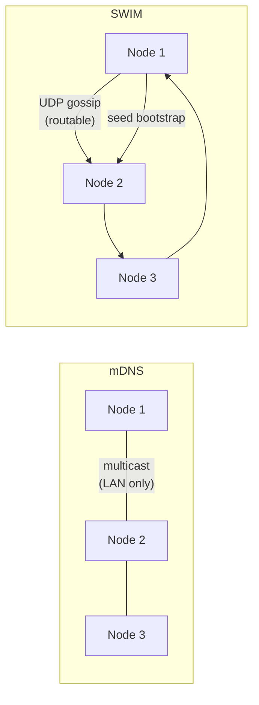

# SWIM Gossip Discovery

Purser agents discover each other through two complementary mechanisms: **mDNS broadcast** (works out of the box on a single LAN segment) and the **SWIM gossip protocol** (opt-in, scales to multi-subnet deployments). This page covers the SWIM layer.

## What SWIM does

SWIM (Scalable Weakly-consistent Infection-style Membership) is a peer-to-peer membership protocol that converges quickly even across router boundaries where mDNS cannot reach. Each node maintains a local membership view through periodic random probing, and membership changes propagate by "gossip" — each node that learns about a change tells a few random peers, and so on until the entire cluster knows.

Purser's SWIM implementation is built on the [`foca`](https://github.com/caio/foca) library and runs over UDP. Each node's SWIM identity carries **two addresses**: the UDP gossip port used by the protocol itself, and the gRPC `AgentService` port that the control plane and peers need to dial. When a `MemberUp` event fires, the gRPC address (not the UDP address) is added to the local membership view so the rest of the system sees the correct dial target.

## Discovery modes side by side



| | mDNS | SWIM |
|---|---|---|
| Default | On | Off (`PURSER_SWIM_ENABLED=true` to enable) |
| Scope | Single LAN segment (no routers) | Any routable IP network |
| Protocol | UDP multicast | UDP unicast |
| Bootstrap | Automatic | Seed addresses required |
| CP notification | Heartbeat gRPC path | Logged at INFO; CP notified via heartbeat (see Known Limitations) |

Both mechanisms run in parallel when SWIM is enabled. mDNS continues to operate unchanged.

## Configuration

| Variable | Default | Description |
|---|---|---|
| `PURSER_SWIM_ENABLED` | `false` | Set `true`, `1`, or `yes` to enable the SWIM gossip layer. When disabled (the default) the existing mDNS + seed path runs unchanged. If the UDP bind fails while enabled, the agent logs a warning and falls back to mDNS + seeds. |
| `PURSER_SWIM_BIND_ADDR` | `0.0.0.0:7946` | UDP socket address the SWIM protocol binds to. Change only when port 7946 is already in use or when you want to restrict SWIM to a specific interface. |
| `PURSER_SWIM_SEED_ADDRS` | (empty) | Comma-separated `host:port` SWIM seed peers to announce to at startup. These are the **UDP gossip addresses** (matching `PURSER_SWIM_BIND_ADDR` on those nodes), not the gRPC addresses. Bootstrap at least two seeds for resilience. |

### Minimal example

```bash
# Node A — seed node
PURSER_SWIM_ENABLED=true \
PURSER_SWIM_BIND_ADDR=0.0.0.0:7946 \
./purser-agent

# Node B — joins via Node A
PURSER_SWIM_ENABLED=true \
PURSER_SWIM_BIND_ADDR=0.0.0.0:7946 \
PURSER_SWIM_SEED_ADDRS=192.168.1.10:7946 \
./purser-agent
```

### Helm (Kubernetes)

```yaml
# values.yaml — for each agent node (set via DaemonSet extraEnv)
extraEnv:
  - name: PURSER_SWIM_ENABLED
    value: "true"
  - name: PURSER_SWIM_SEED_ADDRS
    value: "192.168.1.10:7946,192.168.1.11:7946"
```

## Identity and address resolution

Each SWIM cluster member is identified by a `SwimIdentity` carrying two addresses:

- `swim_addr` — the UDP gossip address used by the foca library for all SWIM protocol traffic.
- `grpc_addr` — the gRPC `AgentService` address that the control plane and peers dial.

On `MemberUp` the `grpc_addr` is logged at `INFO` and added to the local membership view. This means SWIM-discovered peers appear in the same routing table as mDNS-discovered peers, and the control plane can schedule deployments to them via the standard `AgentService` path.

## Known limitations

**N4 — Control Plane not yet notified of SWIM-discovered peers**: when `MemberUp` fires the gRPC address is logged and added to the local `Membership` view. A future step is to include these addresses in `HeartbeatRequest.seen_peers` so the control plane learns about SWIM-discovered nodes without an out-of-band channel. This requires adding a `repeated string seen_peers` field to the proto and regenerating bindings — deferred to a follow-up release. In the current release, SWIM-discovered peers are visible to the agent's local routing but the control plane only learns about them after the peer calls `RegistrationService::Join` directly.

## Firewall requirements

SWIM requires UDP traffic on the gossip port to be open between all fleet nodes:

```
# Allow SWIM gossip between fleet nodes (adjust interface / source range)
iptables -A INPUT -p udp --dport 7946 -s <fleet-subnet> -j ACCEPT
```

The gRPC AgentService port (default 50151 TCP) must also be reachable from the control plane and from other agents.
