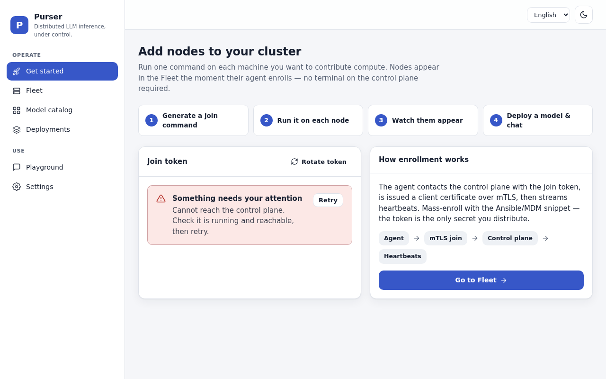
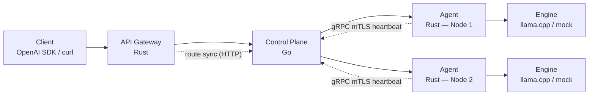
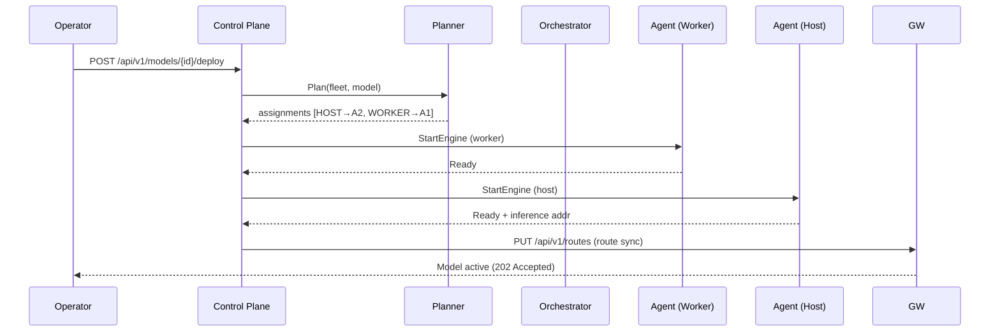
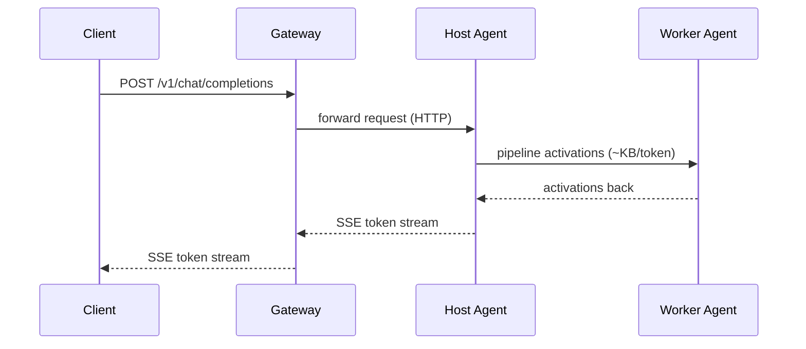
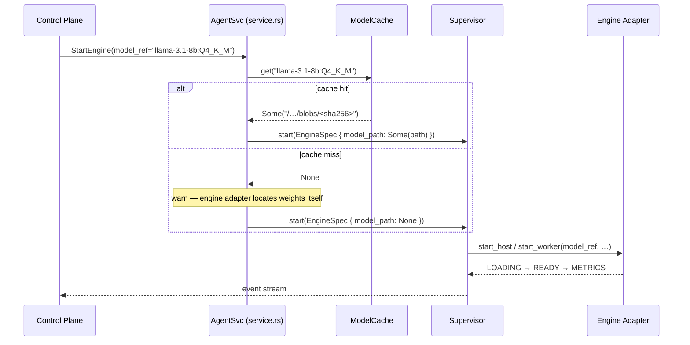

# Architecture

Purser has two clearly separated planes: a low-volume **control plane** (gRPC + mTLS) and a high-volume **data plane** (engine-to-engine activations across the trusted subnet).


*The operator dashboard — fleet overview, deployed models, and live cluster metrics.*

## Component overview



| Component | Language | Path | Description |
|---|---|---|---|
| **Control Plane** | Go | `go/controlplane` | Registry (SQLite), Planner, Orchestrator, Reconciler, internal PKI, REST API (`/api/v1`), RegistrationService gRPC |
| **API Gateway** | Rust | `rust/crates/gateway` | OpenAI-compatible `/v1` endpoint, auth, quota, route-sync from Control Plane |
| **Agent** | Rust | `rust/crates/agent` | Per-node daemon: hardware probe, link benchmark, engine supervisor, model cache, mDNS / SWIM discovery |
| **Engine Adapter** | Rust | `rust/crates/engine-adapter` | `EngineBackend` trait; mock backend (always available) and llama.cpp backend (requires `--features llamacpp`) |
| **Planner** | Go | `go/planner` | Dynamic-programming optimal layer-split algorithm |
| **Dashboard UI** | TypeScript/React | `ui/` | SPA for fleet view, model catalog, deploy, and chat playground |
| **Proto contracts** | Protobuf | `proto/purser/v1` | Source of truth for gRPC types, generating both Go and Rust bindings |

---

## Deploy flow



**Order matters**: workers are started before the host so the full pipeline is ready end-to-end before the host starts accepting inference requests.

---

## Inference request flow



Only activations cross the network between pipeline stages. The data plane stays entirely on the trusted LAN subnet and never passes through Kubernetes.

---

## Two planes

### Control plane

The control plane runs in Kubernetes as three container images:

- **Control Plane** (`ghcr.io/andrew19881123/purser-control-plane`) — the brain. Hosts the SQLite Registry, internal PKI (CA that issues mTLS certificates to agents), the REST `/api/v1` management API, and the gRPC `RegistrationService` (agent enrollment and heartbeat).
- **API Gateway** (`ghcr.io/andrew19881123/purser-gateway`) — the front door. Exposes the OpenAI-compatible `/v1` endpoint. The Control Plane pushes route updates to it over HTTP, authenticated by a shared internal token.
- **Dashboard UI** (`ghcr.io/andrew19881123/purser-ui`) — the operator interface. A React SPA served by nginx.

Control-plane traffic is low-volume: enrollment, heartbeats, plan delivery, `StartEngine` RPCs.

### Data plane

The data plane stays on the trusted LAN subnet between fleet nodes. When a model is split across multiple nodes, only activations (~KB per token) cross the network between pipeline stages. This is pure node-to-node traffic that never passes through Kubernetes.

!!! warning "Trusted LAN assumption"
    Purser assumes a **trusted LAN**. The Agent's inference engine worker is not sandboxed. Never expose agent ports or the inference engine directly to the public internet.

---

## Model cache

Each agent maintains a local, disk-backed model-weight cache (`~/.purser/model-cache` by default). When the control plane sends a `StartEngine` RPC the agent resolves the logical model reference — for example `llama-3.1-8b:Q4_K_M` — to an on-disk GGUF file path before starting the engine adapter. This avoids re-downloading weights on every engine restart and decouples the control plane (which speaks in model IDs) from the engine adapter (which needs a filesystem path).



**Key properties of the cache:**

- **Content-addressed blobs** — two model refs with the same SHA-256 share a single blob file, so quantisation variants of the same base model are deduplicated on disk.
- **Checksum verification** — every artifact is SHA-256-verified before being admitted; a mismatch or partial download is rejected.
- **LRU eviction** under a configurable budget (`PURSER_MODEL_CACHE_MAX_BYTES`, default 50 GiB). The model currently being served is pinned so it is never evicted while the engine is running.
- **Pluggable fetcher** — the default `FileMirrorFetcher` copies from a rack-local NFS / mounted object-store mirror (`PURSER_MODEL_MIRROR_DIR`). An `HttpFetcher` (behind the optional `http-fetch` Cargo feature) pulls from an internet origin with configurable retry logic.

**Environment variables:**

| Variable | Default | Purpose |
|---|---|---|
| `PURSER_MODEL_CACHE_DIR` | `~/.purser/model-cache` | Root directory for blobs and temp files |
| `PURSER_MODEL_CACHE_MAX_BYTES` | `53687091200` (50 GiB) | Maximum total bytes stored in the cache |
| `PURSER_MODEL_MIRROR_DIR` | *(unset)* | Mirror root for `FileMirrorFetcher` relative URLs |
| `PURSER_MODEL_FETCH_MAX_RETRIES` | `3` | HTTP fetch retries (http-fetch feature only) |

---

## Enrollment flow

1. **Join token minted** — operator calls `POST /api/v1/join-token` (or downloads the enrollment bundle from `GET /api/v1/enrollment-bundle`).
2. **Agent starts** — reads `PURSER_JOIN_TOKEN` and `PURSER_CONTROL_PLANE_ADDR`, calls the `RegistrationService` gRPC `Join` RPC.
3. **mTLS certificate issued** — Control Plane signs a certificate for the node with the internal CA.
4. **Node transitions to `READY`** — the fleet is now ready to receive a deployment.

---

## Persistence and HA

The Control Plane's SQLite Registry and internal PKI CA key/cert are stateful and require a PVC (mounted at `/data` in the container). Keep `replicaCount: 1` — SQLite is single-writer.

Multi-replica HA (Raft-replicated Registry + Gateway VIP) is an **Enterprise** feature behind `PURSER_LICENSE_KEY`. See [Enterprise: Open-Core Model](../enterprise/overview.md).

---

## Engine backends

The Agent ships two engine backends:

| Backend | Availability | Description |
|---------|-------------|-------------|
| `mock` | Always (default) | GPU-free deterministic in-process backend. Used in CI and for integration testing without llama.cpp or a GPU. |
| `llamacpp` | Compiled with `--features llamacpp` | Real llama.cpp RPC worker/host processes. Requires `rpc-server` and `llama-server` binaries (from a llama.cpp build) accessible via `PURSER_LLAMACPP_BIN` or `PATH`. |

To build the agent with llama.cpp support:

```bash
cargo build -p purser-agent --features llamacpp
```

Set `PURSER_ENGINE_BACKEND=llamacpp` at runtime to activate it. If the binary is compiled without `--features llamacpp` and `PURSER_ENGINE_BACKEND=llamacpp` is set, the agent exits with a clear error explaining the missing feature flag.

---

## Port reference

| Component | Port | Protocol | Purpose |
|---|---|---|---|
| Control Plane | 8080 | HTTP | Management REST API (`/api/v1`), Dashboard backend |
| Control Plane | 9443 | gRPC/mTLS | RegistrationService (Agent enrollment + heartbeat) |
| Agent | 50151 | gRPC | AgentService (Control Plane → Agent: StartEngine, etc.) |
| Agent | 7946 | UDP | SWIM gossip (opt-in, `PURSER_SWIM_ENABLED=true`) |
| Agent | 8000 | HTTP | Inference endpoint (OpenAI-compatible, served by engine) |
| Agent | 50152 | UDP | Link-benchmark reflector (agent port + 1, best-effort) |
| Gateway | (configured) | HTTP | OpenAI-compatible `/v1` endpoint for clients |
