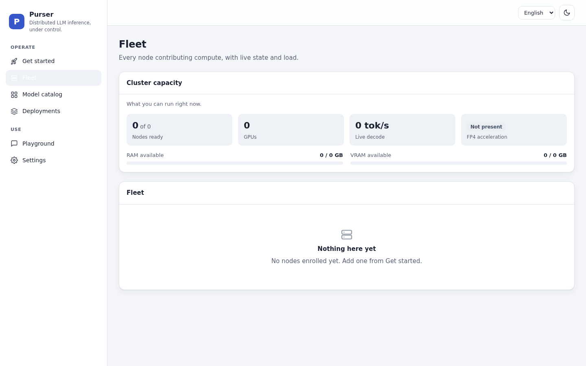
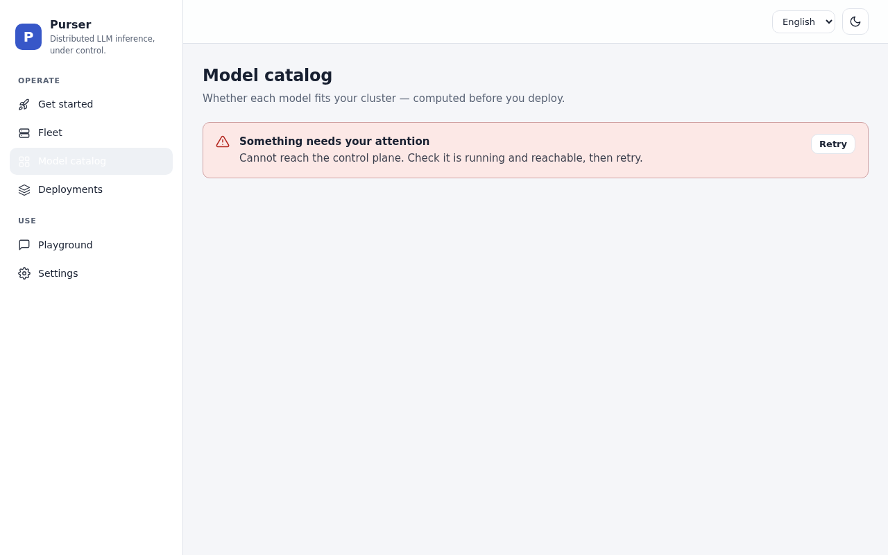

# Purser

> **The Kubernetes of LLM layers** — a zero-config orchestrator for distributed LLM inference on your own hardware.

[](https://github.com/andrew19881123/purser/blob/main/LICENSE)
[](https://github.com/andrew19881123/purser/actions/workflows/ci.yml)
[](https://github.com/andrew19881123/purser/releases/tag/v0.5.0)
[](https://github.com/andrew19881123/purser/blob/main/PROJECT_STATUS.md)

## What is Purser?

Purser turns a fleet of heterogeneous machines on a trusted LAN into a single, OpenAI-compatible inference endpoint. It splits a model **by layer** (pipeline parallelism) across your nodes, plans the optimal split for your specific hardware, and drives **existing** inference engines (llama.cpp, and more) through an Engine Adapter — it does **not** reimplement inference.

If you know Kubernetes, the mental model is familiar:

| Kubernetes | Purser | Role |
|---|---|---|
| Control plane | **Control Plane** | Registry, scheduling, reconciliation, PKI |
| Scheduler | **Planner** | Computes the optimal per-layer split for your fleet |
| kubelet | **Agent** | Per-node daemon that runs and supervises workloads |
| Container runtime | **Engine** (via Adapter) | The thing that actually executes inference |
| Ingress | **API Gateway** | Single OpenAI-compatible front door |

## Dashboard


*The operator dashboard — fleet nodes, deployed models, live metrics.*


*Fleet view: per-node status, hardware profile, active deployments.*


*Models catalog — register, deploy, and manage model versions.*

## Why use Purser?

- **Zero-config** — turn on the machines, deploy a model, get a private ChatGPT-style API. The Planner figures out the split; you don't hand-tune it.
- **Pipeline parallelism over LAN** — only activations (~KB per token) cross the network between stages, so commodity **10GbE** is plenty. No NVLink or InfiniBand required.
- **Private / on-prem** — no data leaves your network by design; air-gap friendly.
- **Bring your own engine** — the Engine Adapter abstracts the backend, so the orchestrator never hard-codes model or engine specifics.
- **OIDC SSO (PKCE)** — EntraID, Okta, and Keycloak supported out of the box; RBAC roles scoped per API key.
- **Tamper-evident audit log** — hash-chained, offline-verifiable compliance trail (enterprise).
- **ARM64 support** — native builds for Apple Silicon and Graviton nodes.
- **Python & TypeScript SDKs** — typed client libraries wrapping the OpenAI-compatible Gateway.
- **llama.cpp backend** — real GPU inference via feature-gated `--features llamacpp` build.
- **Docker Compose demo** — full stack up in two commands, no GPU or Kubernetes required.
- **Webhook notifications** — lifecycle events (deploy, fail, scale) pushed to any HTTP endpoint.

## How it works

```
                     OpenAI-compatible HTTP  (/v1/chat/completions, SSE)
┌────────────┐              │
│  Clients   │──────────────┘
│ (OpenAI    │
│  SDK/curl) │
└──────┬─────┘
       │
       ▼
┌─────────────────────────── Control Plane ────────────────────────────────┐
│                                                                          │
│   ┌──────────────┐        ┌──────────────────────────────────────────┐   │
│   │ API Gateway  │◀──────▶│              Control Plane               │   │
│   │  OpenAI /v1  │ routes │   Planner · Orchestrator · Reconciler    │   │
│   │ auth, quota  │  sync  │ Registry (SQLite) · internal PKI · REST  │   │
│   └──────────────┘        └──────────────────────────────────────────┘   │
│                                                │                         │
└────────────────────────────────────────────────┼─────────────────────────┘
                                                  │  gRPC + mTLS
                                                  │  (enroll, plan,
                                                  ▼   StartEngine, heartbeats)
┌─────────────────────────── Data Plane ───────────────────────────────────┐
│                                                                          │
│  ┌──────────────────────────┐         ┌──────────────────────────┐       │
│  │      Node / Agent        │         │      Node / Agent        │       │
│  │  probe · linkbench       │         │  probe · linkbench       │       │
│  │  supervisor · model cache│         │  supervisor · model cache│       │
│  │  Engine Adapter          │         │  Engine Adapter          │       │
│  │  → llama.cpp (default)   │         │  → llama.cpp (default)   │       │
│  └──────────────────────────┘         └──────────────────────────┘       │
│              ▲                                       ▲                   │
│              └───────────────────────────────────────┘                   │
│   activations (~KB/token) over the trusted subnet — pipeline parallelism │
└──────────────────────────────────────────────────────────────────────────┘
```

**Request flow:** Client → API Gateway `/v1/chat/completions` → the gateway routes to the pipeline **host** → tokens stream back to the client over SSE. When the model is split, the host coordinates the downstream worker stage(s); only activations cross the network.

**Deploy flow:** `enroll` (agent joins over gRPC, becomes `READY`) → **Planner** checks fit and produces a layer-split **plan** → **Orchestrator** calls `StartEngine` on the **worker(s) first, then the host** → the deployment reaches `ACTIVE` → routes **sync** to the Gateway so clients can hit the model.

## Try it in 2 minutes

```bash
git clone https://github.com/andrew19881123/purser.git
cd purser
docker compose up -d
open http://localhost:3000
```

No GPU required — the demo uses the built-in mock engine.

```bash
curl http://localhost:3000/v1/models -H 'Authorization: Bearer demo-key-12345'
```

For production Kubernetes deployments see the [Quickstart guide](getting-started/quickstart.md).

## Component ports

| Component | Binary | Language | Key ports (default) |
|---|---|---|---|
| Control plane | `control-plane` | Go | REST `:8080`, gRPC `:9443` |
| Agent | `purser-agent` | Rust | AgentService `:50151`, inference `:8000` |
| API gateway | `purser-gateway` | Rust | OpenAI-compatible HTTP (configured explicitly) |

## Status

**Alpha — v0.5.0.** The zero-config vertical (*enroll → deploy → chat*) is implemented and demonstrated end-to-end. v0.5 adds: Prometheus metrics on all three components, Grafana provisioning bundle (4 dashboards + SLO alerts), OpenTelemetry GenAI span attributes, mTLS certificate auto-renewal, billing forecast API (burn rate, model adoption, SLA compliance), and AuditPage chain integrity panel. v0.4 added: multi-tenant platform model (Organizations, Teams, RBAC), fine-grained permission system, node pools, service accounts, PostgreSQL backend, LDAP/AD auth, and multi-replica planning. Live inference on real GPU hardware not yet validated — not recommended for production.

See the full [Changelog](changelog.md) for details.

[Get started now →](getting-started/quickstart.md)
