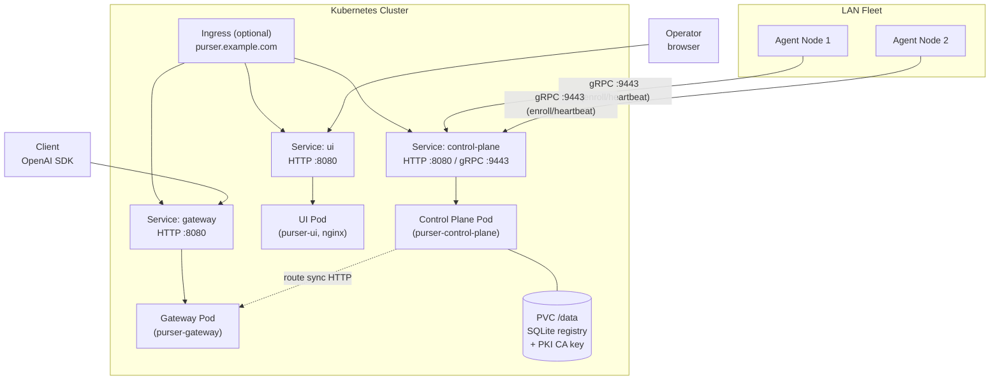

# Kubernetes (Helm)

This guide covers a complete Helm-based install of the Purser control plane (Control Plane, API Gateway, and Dashboard UI) on Kubernetes.

!!! note "Agents run outside Kubernetes"
    Agents run as native host packages on your fleet nodes, not as pods. See [Linux Agent (.deb/.rpm)](linux-agent.md) for the agent install guide.

## Deployment topology



`replicaCount` is kept at 1 — SQLite is single-writer. Set the Control Plane Service type to `LoadBalancer` or `NodePort` so LAN agents can reach it.

## Prerequisites

- Kubernetes 1.24+ cluster
- Helm v3.8+ (for OCI chart support)
- A default StorageClass (for the Control Plane PVC)

## One-command install

The chart is published as an OCI artifact on GHCR. The images are public — no pull secret needed:

```bash
helm install purser oci://ghcr.io/andrew19881123/charts/purser --version 0.3.0 \
  --set controlPlane.service.type=LoadBalancer
```

`--set controlPlane.service.type=LoadBalancer` is required when Agents run outside the cluster — it exposes the gRPC RegistrationService (`:9443`) and REST API (`:8080`) to the LAN. With the default `ClusterIP`, Agents cannot reach the Control Plane.

## Verify chart signature

The Helm chart OCI artefact is signed with [cosign](https://docs.sigstore.dev/cosign/overview/) keyless signatures using the GitHub Actions OIDC identity. Verify the chart before installing:

```bash
cosign verify \
  --certificate-identity-regexp="https://github.com/andrew19881123/purser/.github/workflows/release.yml@refs/tags/.*" \
  --certificate-oidc-issuer="https://token.actions.githubusercontent.com" \
  oci://ghcr.io/andrew19881123/charts/purser:<VERSION>
```

Replace `<VERSION>` with the numeric chart version (e.g. `0.3.0`). A successful verification prints the certificate chain and digest — no key management required. Verification uses the Sigstore transparency log (Rekor) to confirm the signature was produced by the official release workflow.

## Install from source

To customize the chart or install without OCI:

```bash
git clone https://github.com/andrew19881123/purser.git
cd purser
helm install purser deploy/helm/purser \
  --set controlPlane.service.type=LoadBalancer
```

## Key values

| Value | Default | Description |
|---|---|---|
| `replicaCount` | `1` | **Keep at 1.** SQLite Registry and internal PKI are single-writer. Multi-replica HA needs the Enterprise Raft backend. |
| `service.type` | `ClusterIP` | Global default Service type; each component inherits unless overridden. |
| `controlPlane.httpPort` | `8080` | Management REST API listen port. |
| `controlPlane.grpcPort` | `9443` | RegistrationService gRPC (Agent enrollment and heartbeat). |
| `controlPlane.clusterId` | `default` | Cluster identifier echoed in join tokens. Maps to `PURSER_CLUSTER_ID`. |
| `controlPlane.agentPort` | `0` | AgentService port the orchestrator dials on each node. `0` uses the default `50151`. |
| `controlPlane.service.type` | (inherits) | Set `LoadBalancer` or `NodePort` so out-of-cluster Agents can reach it. |
| `controlPlane.service.httpNodePort` | (auto) | NodePort for HTTP (only when `type=NodePort`). |
| `controlPlane.service.grpcNodePort` | (auto) | NodePort for gRPC (only when `type=NodePort`). |
| `controlPlane.persistence.enabled` | `true` | Mount a PVC at `/data` for the SQLite registry and PKI CA. |
| `controlPlane.persistence.size` | `2Gi` | PVC size. |
| `controlPlane.persistence.storageClass` | (cluster default) | StorageClass for the PVC. |
| `controlPlane.extraEnv` | `[]` | Extra environment variables injected into the Control Plane pod. |
| `gateway.port` | `8080` | Port the gateway binds inside the pod. |
| `gateway.internalToken` | (auto-generated) | Shared secret for Control Plane → Gateway route sync. Generated randomly at install and reused on upgrade. Pin with `--set gateway.internalToken=...`. |
| `gateway.apiKeys` | `""` | Comma-separated client bearer tokens. **Empty = OPEN DEV MODE** (any non-empty bearer accepted). Always set this in production. |
| `gateway.extraEnv` | `[]` | Extra environment variables for the Gateway pod. |
| `ui.apiBaseUrl` | `/api/v1` | Base URL the browser uses for the Control Plane REST API. Same-origin by default; set an absolute URL when the UI and API are on different origins. |
| `ui.gatewayBaseUrl` | `/v1` | OpenAI-compatible Gateway base URL for the Playground. |
| `ingress.enabled` | `false` | Enable a Kubernetes Ingress (single-hostname mode). |
| `ingress.host` | `""` | Required when `ingress.enabled=true`. |
| `license.key` | `""` | Enterprise license key (`PURSER_LICENSE_KEY`). Empty = community edition. |
| `image.controlPlane.repository` | `ghcr.io/andrew19881123/purser-control-plane` | Control Plane image repository. |
| `image.controlPlane.tag` | `0.3.0` | Control Plane image tag. |
| `image.gateway.repository` | `ghcr.io/andrew19881123/purser-gateway` | Gateway image repository. |
| `image.gateway.tag` | `0.3.0` | Gateway image tag. |
| `image.ui.repository` | `ghcr.io/andrew19881123/purser-ui` | UI image repository. |
| `image.ui.tag` | `0.3.0` | UI image tag. |
| `imagePullSecrets` | `[]` | Pull secrets for a private registry (not needed for GHCR public images). |
| `podSecurityContext.fsGroup` | `65532` | Distroless image runs as UID 65532; fsGroup makes the PVC group-writable. |

## Networking models

### Model 1: LoadBalancer (recommended for LAN fleets)

Each component gets its own Service. Set the Control Plane to `LoadBalancer` so out-of-cluster Agents can register:

```bash
helm install purser oci://ghcr.io/andrew19881123/charts/purser --version 0.3.0 \
  --set controlPlane.service.type=LoadBalancer
```

Agents on the LAN reach the Control Plane's external IP directly. Expose the Gateway and UI separately if needed:

```bash
helm upgrade purser oci://ghcr.io/andrew19881123/charts/purser --version 0.3.0 \
  --set controlPlane.service.type=LoadBalancer \
  --set gateway.service.type=LoadBalancer \
  --set ui.service.type=LoadBalancer
```

### Model 2: NodePort (on-prem without cloud LB)

Use NodePort with pinned ports:

```bash
helm install purser oci://ghcr.io/andrew19881123/charts/purser --version 0.3.0 \
  --set controlPlane.service.type=NodePort \
  --set controlPlane.service.httpNodePort=30080 \
  --set controlPlane.service.grpcNodePort=30443
```

### Model 3: Ingress (single-hostname)

All three components served from one hostname via a Kubernetes Ingress. Path routing:

| Path prefix | Backend | Port |
|---|---|---|
| `/api` | control-plane | 8080 |
| `/v1` | gateway | 8080 |
| `/` | ui (nginx) | 8080 |

```bash
helm install purser oci://ghcr.io/andrew19881123/charts/purser --version 0.3.0 \
  --set ingress.enabled=true \
  --set ingress.host=purser.example.com \
  --set ingress.className=nginx
```

With the Ingress in place, the UI's same-origin defaults (`/api/v1` and `/v1`) work without any `apiBaseUrl` / `gatewayBaseUrl` overrides.

TLS with cert-manager:

```bash
helm install purser oci://ghcr.io/andrew19881123/charts/purser --version 0.3.0 \
  --set ingress.enabled=true \
  --set ingress.host=purser.example.com \
  --set ingress.className=nginx \
  --set "ingress.annotations.cert-manager\.io/cluster-issuer=letsencrypt-prod" \
  --set ingress.tls[0].secretName=purser-tls \
  --set ingress.tls[0].hosts[0]=purser.example.com
```

!!! warning "gRPC cannot route through HTTP/1.1 Ingress"
    Agents always contact the Control Plane directly on gRPC port 9443. Do not attempt to route gRPC through an HTTP/1.1 Ingress. Keep the Control Plane Service accessible on its own IP for Agent enrollment even when using Ingress mode.

## Image pull from GHCR (public, no pull secret needed)

The official images are **public** on GHCR. No authentication required:

```
ghcr.io/andrew19881123/purser-control-plane:0.3.0
ghcr.io/andrew19881123/purser-gateway:0.3.0
ghcr.io/andrew19881123/purser-ui:0.3.0
```

If you mirror images to your own private registry, create a pull secret and reference it:

```bash
kubectl create secret docker-registry regcred \
  --docker-server=registry.example.com \
  --docker-username=<user> \
  --docker-password=<token>

helm install purser oci://ghcr.io/andrew19881123/charts/purser --version 0.3.0 \
  --set imagePullSecrets[0].name=regcred \
  --set image.controlPlane.repository=registry.example.com/purser/control-plane \
  --set image.gateway.repository=registry.example.com/purser/gateway \
  --set image.ui.repository=registry.example.com/purser/ui
```

## Persistence

The Control Plane requires a PVC for:
- The SQLite registry file (`PURSER_DB`, default `/data/purser-registry.db`)
- The internal CA key and certificate (`PURSER_PKI_DIR`, default `/data/pki-state`)

The chart creates a PVC with the configured StorageClass (`controlPlane.persistence.storageClass`). Use an existing claim with `controlPlane.persistence.existingClaim`.

!!! warning "PVCs are retained on uninstall"
    `helm uninstall purser` does **not** delete PVCs by design — they hold the Registry and CA. To remove them explicitly: `kubectl delete pvc -l app.kubernetes.io/instance=purser`

## Upgrade

```bash
helm upgrade purser oci://ghcr.io/andrew19881123/charts/purser --version 0.3.0
```

The chart uses `--reuse-values` semantics for the gateway internal token (auto-generated at install time and reused on upgrade) to avoid breaking the Control Plane → Gateway route sync.

## Uninstall

```bash
helm uninstall purser
# Remove the retained PVC explicitly if needed:
kubectl delete pvc -l app.kubernetes.io/instance=purser
```

## TLS termination options

The management REST API (`/api/v1`) and the operator dashboard can be secured with TLS. Three patterns are available for Kubernetes deployments:

### Option A: Ingress TLS (recommended for production)

Let the Ingress controller terminate TLS. The Control Plane pod itself stays on plain HTTP and is only reachable cluster-internally:

```bash
helm install purser oci://ghcr.io/andrew19881123/charts/purser --version 0.3.0 \
  --set ingress.enabled=true \
  --set ingress.host=purser.example.com \
  --set ingress.className=nginx \
  --set "ingress.annotations.cert-manager\.io/cluster-issuer=letsencrypt-prod" \
  --set ingress.tls[0].secretName=purser-tls \
  --set ingress.tls[0].hosts[0]=purser.example.com
```

See [Networking models — Model 3: Ingress](#model-3-ingress-single-hostname) above for the full routing table.

### Option B: Internal PKI auto-TLS (`PURSER_TLS_AUTO`)

The Control Plane issues a self-signed certificate for itself from the internal PKI CA at startup. No cert-manager or external CA required. The certificate is held in memory and renewed on pod restart.

```yaml
controlPlane:
  extraEnv:
    - name: PURSER_TLS_AUTO
      value: "true"
```

Useful for: air-gapped clusters, development namespaces, and any environment where the management API is not exposed outside the cluster (e.g. accessed only via `kubectl port-forward`).

### Option C: Explicit cert/key (`PURSER_TLS_CERT` / `PURSER_TLS_KEY`)

Mount a TLS certificate and private key from a Kubernetes Secret and point the Control Plane at the mounted files:

```yaml
controlPlane:
  extraEnv:
    - name: PURSER_TLS_CERT
      value: /tls/tls.crt
    - name: PURSER_TLS_KEY
      value: /tls/tls.key
  # Mount the Secret as a volume (outside the Helm chart — use extraVolumes /
  # extraVolumeMounts if your chart version supports them, or patch the Deployment).
```

Create the Secret from cert-manager or from your own CA:

```bash
kubectl create secret tls purser-mgmt-tls \
  --cert=server.crt --key=server.key
```

!!! note "Rate limiting"
    The management API has a built-in per-IP and per-API-key rate limiter (100 RPS and 50 RPS by default). Tune via `PURSER_RATE_LIMIT_RPS` and `PURSER_RATE_LIMIT_KEY_RPS` in `controlPlane.extraEnv`. See [Environment Variables](../configuration/env-vars.md#rate-limiting-for-the-management-api) for details.

## Enterprise options

- **License key**: set `license.key` to enable enterprise features. The key is stored in a Kubernetes Secret and injected as `PURSER_LICENSE_KEY` into the Control Plane pod. See [Enterprise: Open-Core Model](../enterprise/overview.md).
- **External Secrets Operator**: see [Secret Management](../configuration/secrets.md).
- **cert-manager**: see [Certificate Management](../configuration/cert-manager.md).
