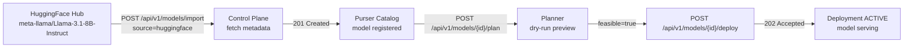

# HuggingFace Hub Integration

Purser can auto-populate a model catalog entry from a
[HuggingFace Hub](https://huggingface.co) repository.  The import endpoint
fetches the model's file list from the HF API, filters for GGUF files, and
registers the model in the catalog — no manual spec authoring required.

## Import and deploy flow



## Configuration

| Environment variable | Description |
|---|---|
| `PURSER_HF_TOKEN` | HuggingFace API token. Optional for public models; required for private and gated models. |

Set the token before starting the control plane:

```bash
export PURSER_HF_TOKEN=hf_xxxxxxxxxxxx
./purser-controlplane
```

The token can also be supplied per-request via the `X-HF-Token` request header
(see [Per-request token](#per-request-token) below).  The header takes
precedence over the server environment variable, so CI workflows can override
the server default without a restart.

## Importing a public model

```bash
curl -X POST http://localhost:8080/api/v1/models/import \
  -H "Content-Type: application/json" \
  -d '{
    "source":   "huggingface",
    "repo":     "meta-llama/Llama-3.1-8B-Instruct",
    "revision": "main"
  }'
```

A `201 Created` response contains the registered model:

```json
{
  "id":     "Llama-3.1-8B-Instruct",
  "family": "llama",
  "source": {
    "type":             "huggingface",
    "repo":             "meta-llama/Llama-3.1-8B-Instruct",
    "revision":         "main",
    "filename":         "Meta-Llama-3.1-8B-Instruct-Q4_K_M.gguf",
    "size_bytes_total": 4938035200
  },
  "created_at": "2026-09-05T12:00:00Z",
  "updated_at": "2026-09-05T12:00:00Z"
}
```

The `id` field is the last path component of the repo (`Llama-3.1-8B-Instruct`
in this example).  If a model with that id already exists the import returns
`409 Conflict`.

## Importing a private or gated model

Private and gated models (e.g. `meta-llama/*`) require a HuggingFace token
with read access to the repository.

**Server-wide token** — set `PURSER_HF_TOKEN` before starting the control
plane (see [Configuration](#configuration)).

**Per-request token** — pass the token in the `X-HF-Token` header:

```bash
curl -X POST http://localhost:8080/api/v1/models/import \
  -H "Content-Type: application/json" \
  -H "X-HF-Token: hf_xxxxxxxxxxxx" \
  -d '{
    "source":   "huggingface",
    "repo":     "meta-llama/Llama-3.1-8B-Instruct",
    "revision": "main"
  }'
```

Without a valid token the endpoint returns `401 Unauthorized` with error code
`hf_auth_required`.

## Filtering with `filename_pattern`

By default the importer collects **all** `.gguf` files in the repository and
sums their sizes.  Use `filename_pattern` to select a specific quantisation:

```bash
curl -X POST http://localhost:8080/api/v1/models/import \
  -H "Content-Type: application/json" \
  -d '{
    "source":           "huggingface",
    "repo":             "ggml-org/Llama-3.1-8B-Instruct-GGUF",
    "revision":         "main",
    "filename_pattern": "*.Q4_K_M.gguf"
  }'
```

The pattern is a [`path.Match`](https://pkg.go.dev/path#Match) glob matched
against the **basename** of each file.  `*` matches any sequence of non-`/`
characters.  Common patterns:

| Pattern | Selects |
|---|---|
| `*.gguf` | All GGUF files (default) |
| `*.Q4_K_M.gguf` | Q4\_K\_M quantisation |
| `*.Q8_0.gguf` | Q8\_0 quantisation |

If no files match the pattern the endpoint returns `400 Bad Request` with
error code `no_matching_files`.

## Deploying after import

Once imported the model is available in the catalog and can be deployed like
any other model:

```bash
# 1. Check the model landed in the catalog.
curl http://localhost:8080/api/v1/models | jq '.models[] | select(.id == "Llama-3.1-8B-Instruct")'

# 2. Preview the deployment plan (dry run).
curl -X POST http://localhost:8080/api/v1/models/Llama-3.1-8B-Instruct/plan

# 3. Deploy (the planner auto-selects nodes).
curl -X POST http://localhost:8080/api/v1/models/Llama-3.1-8B-Instruct/deploy
```

See the [Deployment guide](../deployment.md) for details on plans and
deployment lifecycle.

## Error reference

| HTTP status | `error` code | Meaning |
|---|---|---|
| `400 Bad Request` | `bad_request` | Missing or invalid request body |
| `400 Bad Request` | `no_matching_files` | No GGUF files match the pattern |
| `400 Bad Request` | `unsupported_source` | `source` is not `huggingface` |
| `401 Unauthorized` | `hf_auth_required` | HF API returned 401/403; supply a token |
| `404 Not Found` | `not_found` | HF repo does not exist |
| `409 Conflict` | `model_exists` | A model with this id is already in the catalog |
| `502 Bad Gateway` | `hf_fetch_failed` | Network error reaching HuggingFace API |
